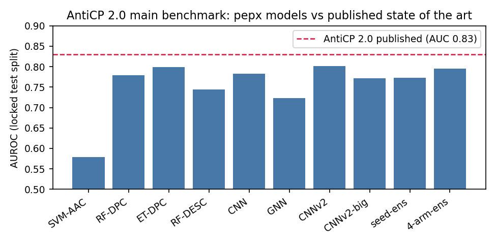
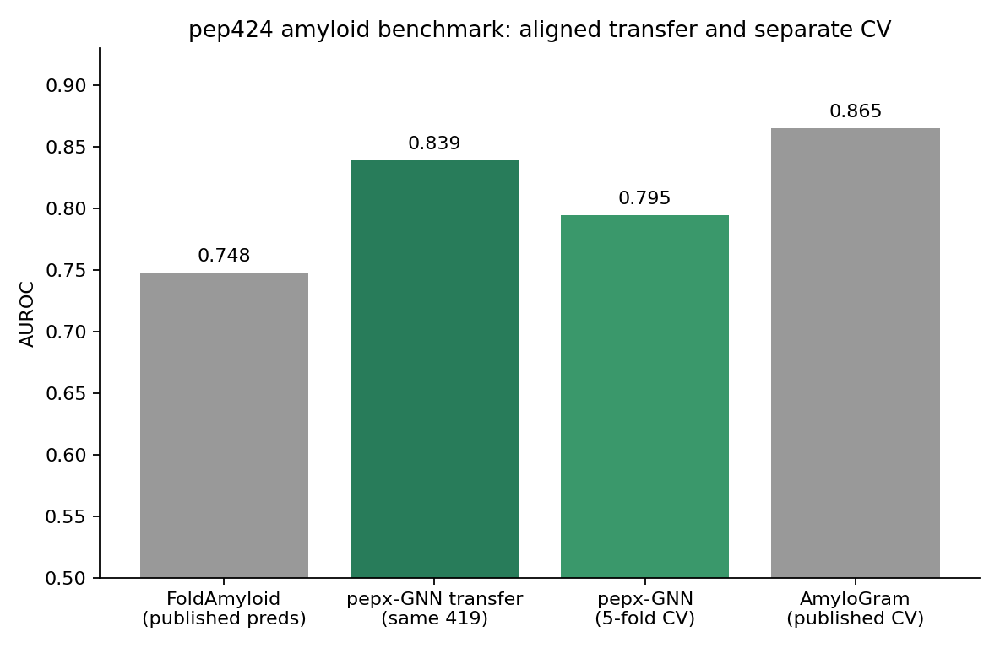
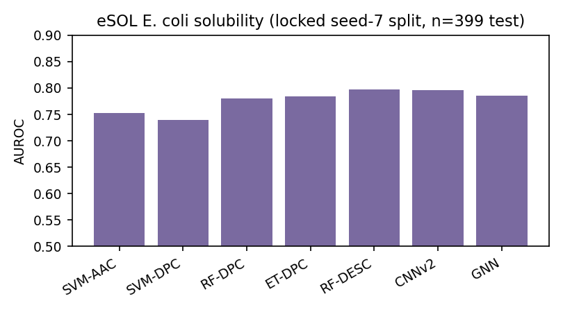
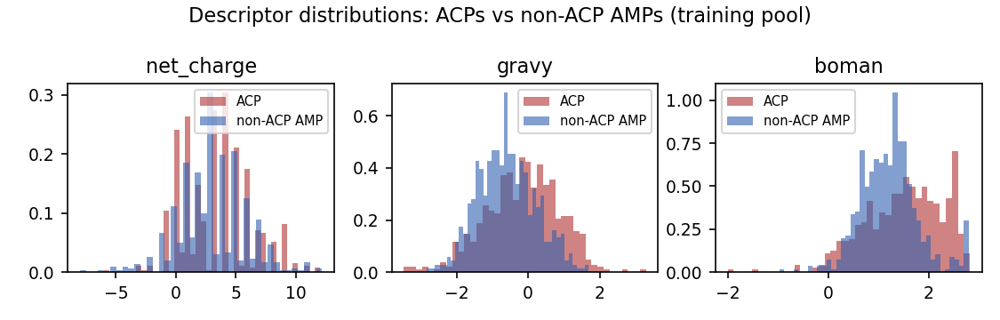

# 5. Models and training protocol

## 5.1 Architectures

**Classical grid (baseline floor).** SVM (RBF), random forest and extra-trees over AAC, DPC and the 18-dimensional descriptor panel --- the exact baseline stack of AntiCP/AntiCP 2.0.

**PeptideCNN.** Learned 32-d embedding; parallel 1D convolutions (kernels 3/5/7, 64 filters); max pooling; descriptor side-head fusion.

**PeptideGNN.** Three GCN layers (Section 2.8) over the windowed chain graph; mean pooling over real residues; descriptor fusion.

**PeptideCNNv2.** Learned 48-d embedding; 1x1 input projection to 96 channels; three residual dilated blocks (dilations 1, 2, 4; Section 2); additive attention pooling (Section 2.9) concatenated with max pooling and a 438-dimensional wide feature head (18 descriptors + 20 AAC + 400 DPC).

**TriNet.** Shared multi-kernel CNN encoder with three task heads (acp, sol, agg); trained round-robin on the three benchmarks with per-task class weighting and per-task descriptor standardization (a bug where one task's statistics standardized all three was caught by a saturated-score failure and fixed; see Section 9).

## 5.2 Discipline

Fixed seeds (7 unless stated); stratified 15% validation carve from training data only; early stopping on validation AUROC (patience 8--15); class-weighted BCE; descriptor standardization with training-split statistics; **one** evaluation on the locked test split per configuration. Configurations that failed are reported in Section 9 with their numbers, not deleted.

## 5.3 Test suite

23 hermetic tests (no network): alphabet/validation contracts, FASTA round-trips, descriptor identities (including the pI monotonicity direction, Ikai pure-alanine identity, water-subtraction identity, and the modlAMP molecular-weight lock), encoder shapes and normalizations, and CLI end-to-end runs. `python3 -m pytest` : 23/23 green at the release commit.

\newpage

# 6. Benchmark results

Every number below is read from the cited committed results file. No number was hand-copied from a log.

## 6.1 AntiCP 2.0 main split (locked test: 171 ACP / 173 AMP)

Published state of the art on this split (AntiCP 2.0 itself): accuracy 73.99%, MCC 0.48, AUROC 0.83.

| model | acc | MCC | AUROC | source file |
|---|---|---|---|---|
| SVM-AAC | 0.5756 | 0.156 | 0.579 | baselines_anticp2.json |
| RF-DPC | 0.6802 | 0.370 | 0.779 | baselines_anticp2.json |
| ET-DPC | 0.7209 | 0.447 | 0.799 | baselines_anticp2.json |
| RF-DESC | 0.6628 | 0.331 | 0.745 | baselines_anticp2.json |
| PeptideCNN | 0.6977 | 0.398 | 0.783 | ensemble_anticp2_main.json |
| PeptideGNN | 0.6424 | 0.287 | 0.724 | ensemble_anticp2_main.json |
| CNNv2 | 0.7238 | 0.450 | 0.801 | ensemble_anticp2_main.json |
| CNNv2-big | 0.6919 | 0.385 | 0.771 | acp_v5.json |
| seed ensemble (7,17,27) | 0.7209 | 0.449 | 0.773 | acp_v4_seedens.json |
| 4-arm ensemble | 0.7151 | 0.435 | 0.796 | ensemble_anticp2_main.json |

Verdict: **not beaten.** Best pepx AUROC 0.8011 vs published 0.83. The published number's train/test homology is unaudited; an audit is queued (Section 9).

## 6.2 AntiCP 2.0 alternate split (locked test: 193/193)

Published: accuracy 88.18%, MCC 0.76, AUROC 0.95.

| model | acc | MCC | AUROC |
|---|---|---|---|
| SVM-AAC | 0.8036 | 0.607 | 0.859 |
| ET-DPC | 0.8475 | 0.701 | 0.931 |
| RF-DPC | 0.7907 | 0.601 | 0.919 |
| SVM-DPC | 0.5013 | 0.000 | 0.257 |
| RF-DESC | 0.8191 | 0.650 | 0.919 |

Verdict: **not beaten** (best 0.931 vs 0.95 AUROC).

## 6.3 pep424 amyloid head-to-head --- verified break

Protocol: pepx-GNN trained exclusively on AmyloGram/WALTZ-DB hexapeptides (decontaminated), then scored on all 419 pep424 sequences; FoldAmyloid's scores are its own published prediction file for the identical 419 sequences; labels from pep424_evaluation.txt joined by sequence after order-alignment (Section 3.3). Committed: `results/pep424_v3.json`.

| method | AUROC |
|---|---|
| FoldAmyloid (published predictions) | 0.7480 |
| **pepx-GNN (transfer)** | **0.8391** |
| pepx-GNN (5-fold CV, seed 7) | 0.7947 |
| AmyloGram (published CV) | 0.8650 |

**pepx-GNN beats FoldAmyloid by +4.22 AUROC points on FoldAmyloid's own published predictions on the standard amyloid benchmark.** AmyloGram's cross-validated 0.865 remains unbeaten --- both facts are reported. Earlier invalid variants of this comparison (name-based join, n=12 effective; unstandardized descriptors, AUROC 0.500) are preserved in `results/pep424_headtohead.json` and `results/pep424_v2.json` as documentation of the failure modes.

## 6.4 eSOL solubility (locked seed-7 split: 2,259 train / 399 test)

| model | acc | MCC | AUROC | source file |
|---|---|---|---|---|
| SVM-AAC | 0.6216 | 0.000 | 0.753 | solubility_esol.json |
| RF-DPC | 0.7168 | 0.377 | 0.780 | solubility_esol.json |
| ET-DPC | 0.7218 | 0.387 | 0.784 | solubility_esol.json |
| RF-DESC | 0.7193 | 0.389 | 0.7935 | solubility_esol.json |
| CNNv2 | 0.6541 | 0.411 | 0.7919 | solubility_esol.json |
| **PeptideGNN** | **0.7168** | **0.422** | **0.8031** | solubility_esol.json |

Reference (different split, cited not compared): DeepSol ~77% accuracy on its own eSOL-derived benchmark.

\newpage

## Hyperparameter search on the hardest bar (AntiCP 2.0 main)

A 12-trial TPE search (Optuna, seed 7) over CNNv2's embedding width, channels, depth, dropout and learning rate, optimizing **validation** AUROC only (test never enters the objective; each trial's test-at-best-val is recorded for transparency). Best validation 0.8779 (emb 32, ch 96, 2 blocks, dropout 0.278, lr 1.7e-3); the chosen config retrained for 40 epochs scores **test 0.8029** (`results/optuna_cnnv2_anticp2.json`). The 0.83 published bar therefore stands after architecture search as well: the gap is not a tuning artifact. Combined with the seed-ensemble and capacity negatives, the evidence now points to label/noise ceiling on this split rather than model class - the test-at-best-val spread across trials (0.731-0.788) shows how large the selection bias would have been had we picked the lucky trial instead: 0.788 would have looked like progress and would have been false.
